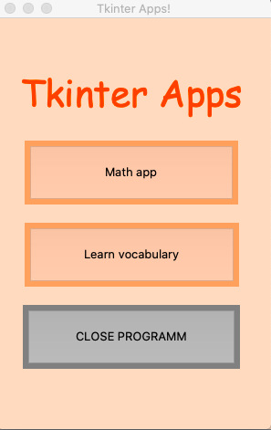
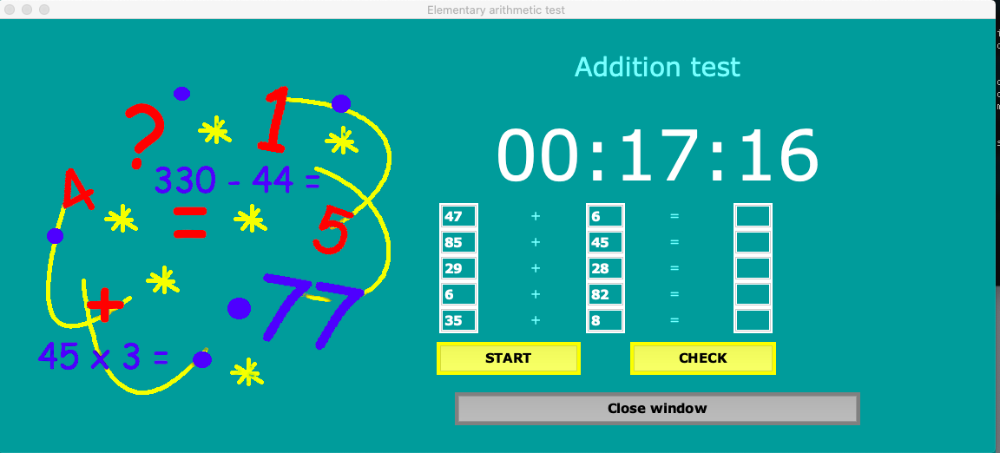
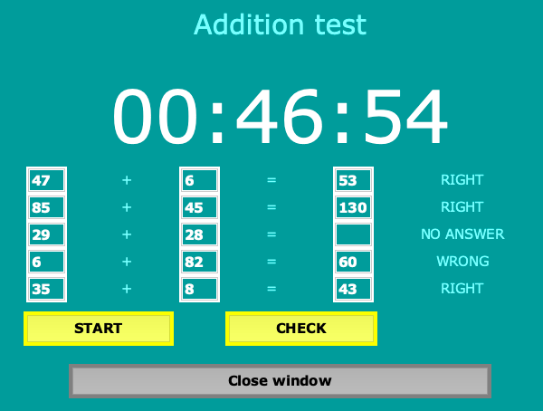
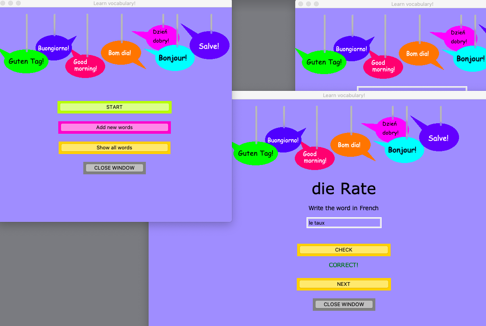
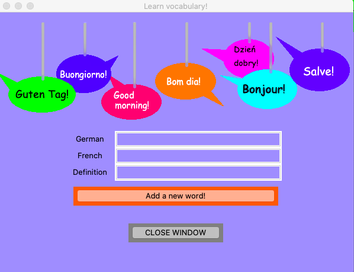

# Tkinter apps

## General info
This collection of desktop apps allows you to learn French vocabulary or train elementary arithmetic. 

## Table of contents
* [Screenshots](#screenshots)
* [Setup](#setup)
* [Usage](#usage)
* [Owner](#owner)
* [License](#license)

## Screenshots

### Math app:


### Learn vocabulary:



## Setup
### Clone the source:

```shell
$ git clone https://github.com/milenakowalska/Tkinter_apps
$ cd Tkinter_apps
```
### Install packages

```shell
$ pip3 install -r requirements.txt
```
### Run and open the app

Run the code in terminal:

```shell
$ python3 Tkinter_apps.py
```

## Usage
Choose from the main window the application which you want to run. The following 2 apps are available: \

1. Math app - a simple programm for training elementary arithmetic. After choosing the category (addition, subtraction, multiplication or division) you should click the "start" button. You'll see 5 math operations - please put the result in the fields and click the "check button". \

2. Learn vocabulary - an application for German speakers who learn French. Click the "start" button to begin the learning session. You can also add new words to the database by clicking the "Add new words" button (required information: German word, French word and definition). All saved words are listed when you click the button "Show all words". \

## Owner
Created by milenakowalska.

## License
[](http://badges.mit-license.org)

- **[MIT license](http://opensource.org/licenses/mit-license.php)**
